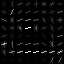
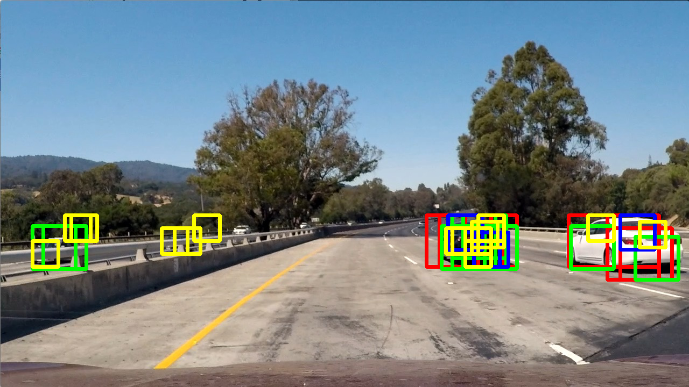

# Vehicle Detection

## Organization of code

All the code are organized either under `cars/` or under `test/` directory. The `test/` directory is just to keep scripts to test individual stages of the pipeline, wherever applicable.

## Source classes

While I address the pipeline in the next segment, I explain the purpose of each class in this one. This should give a good sense of the components of the pipeline.

### 1. ImageDraw (`cars/draw.py`)

This class allows us to draw a bounding box, given the top left and bottom right co-ordinates of a rectangle.

This class allows the selection of the color for the bounding box, as well as the thickness of the line. The color defaults to `red`, and the thickness of `6` is used throughout the pipeline.

### 2. VehicleData (`cars/data.py`)

It is assumed that the data from Udacity is stored inside of a directory like `data`, at the same level as the `cars` directory.

Inside of the `data` directory, it is expected that we will have two folders, one for `vehicle` data and one for `non-vehicle` data. These paths are predefined in the class. The actual images are located in further sub-directories.

The `get_cars_images` function gets a list of `vehicle` image paths. The `get_non_cars_images` does the same for `non-vehicle`.

### 3. CarFeatures (`cars/features.py`)

This class is responsible for calculating all image features. The constructor takes a lot of useful parameters like the color space, number and range of color histogram bins, spatial bin sizes, and HOG parameters.

This class makes sure that we do the same transformation using the same parameters while training and executing the pipeline on the video.

The `rgb_to_cspace` converts an RGB image to a supported list of color spaces.

The `get_color_histogram` calculates histogram on all channels of a multi-channel image, and then concatenates them into a single vector.

The `get_spatial_bin` resizes the image to the given spatial size and vectorizes the result.

The `get_hog_features` function calculates HOG features given the parameters in the constructor of the function.

The `extract_features` acts as a convenient function to calculate all the 3 features above for a given image and concatenate them into a single vector.

Let's look at some of the HOG features from the training dataset (64x64 images):

       

     

### 4. CarsClassifier (`cars/classifier.py`)

This class is responsible for training an SVC classifier, and serializing it/loading it from disk.

The classifier saves model data as `classifier_data.pickle`. Additionally, it can also save the intermediate features generated in files called `cars_features.pickle` and `non_cars_features.pickle`. Since HOG features are computationally expensive to calculate, saving the calculated can allow one to iterate on the "model parameters."

However, since I got an accuracy of 98.96% on the test set, I didn't do any further optimizations on the classifier.

### 5. CarsDetector (`data/detector.py`)

The primary purpose of this class is to detect bounding boxes on a single static image.

This detector takes the instances of `CarsFeature`, `CarsClassifier`, and the "search window" as constructor parameters. This allows us to specify all the detection parameters just once inside of `CarsFeatures`, and have `CarsDetector` re-use it.

The `detect_cars` function takes in an image and returns a list of bounding boxes. Since we calculate HOG for the entire image just once for efficiency, the `scale` parameter indicates what the scale of the window should be.

The training images are PNGs, so their values range from 0 to 1. However, during execution, we get JPEGs (values ranging from 0 to 255). The `rescale` parameter allows us to rescale JPEGs to between 0 and 1.

We divide the portion of interest into blocks and slide our "search window" over it, and only take HOG features for that portion of the image (from the one we pre-calculated for the entire image). Then, for that portion of the image, we calculate the color histogram and spatial features.

Every region in the window are then given to the classifier to predict. If the classifier returns `1`, then the bounding box is added to the list of matches.

### 6. VideoCarsDetector (`data/detector.py`)

This class is responsible for using `CarsDetector` while keeping context of each frame in the video. It averages the "heatmap" and bounding boxes from the past `n` frames to keep the bounding box from wobbling.

In each iteration, when we get bounding boxes for a desired set of scales (I used several) on an image, the video detector creates a blank "heatmap". It then adds 1 to every pixel that was covered by a bounding box. If there were multiple bounding boxes, then that pixel gets incremented multiple times.

After that, this `heatmap` is summed with heatmaps from the previous frames. We use `deque` to maintain last `n` frames.

This heatmap is then appropriately thresholded, and the `label` function from `scipy` is applied to get a "combined" bounding box.

This function has an ability to store the heatmap for every frame as a pickle dump. This allowed me to adjust the "thresholding" behavior without having to calculate features for the video every time.

### 7. `main.py`

This is the file to run for everything. To make sure that `cars` directory is in the `PYTHONPATH`, I created a script called `run_python`.

To train the classifier, run `./run_python cars/main.py train`. The trained file is already present in `classifier_data.pickle`.

To test the pipeline on the test images, run `./run_python cars/main.py detect_image`

To run the pipeline on the video, run `./run_python cars/main.py detect_video project_video.mp4`

## Rubric Points

### 1. HOG Parameters Extraction

The `CarsFeatures` class in `cars/features.py` is responsible for extracting HOG features. It happens inside of the `get_hog_features` function.

The parameters for the HOG function are:
1. orient: 9
1. pixel_per_cell: 8
1. cell_per_block: 2

These are the reasonable defaults that I started with from the project lecture videos. However, I didn't have to change them through the course of completing the project.

This is how the HOG parameter extraction looks on a couple of training images.

       

     

### 2. Training of the classifier

The classifier is trained using the `CarsClassifier` specified inside of `cars/classifier.py`. The `StandardScaler` is used to preprocess the data, and `LinearSVM` is used to train a classifier.

Both the model and the scaler are then serialized and stored for future use during the pipeline execution.

A test score of 98.96% was achieved on the classifier.

### 3. Sliding window approach

Since HOG parameters are computationally expensive to calculate, I calculate it for an entire image at once, and then extract portions of it as features for the classifier to predict.

There were two objectives of choosing the "right" values for scales. One was to increase the confidence of the positive detection, and the second was to reduce the confidence of false detections. All in all, the threshold should be able to draw a clear line between positive and false detections.

To come up with the right values for scales, I ran `./run_python cars/main.py detect_image`. Let's look at the output:

The scale size of `0.75` (yellow) helps reinforce positive detections, though it doesn't necessarily cover all of a car. Also, it results in a lot of false detections. However, adding this helped reduce the "wobbling" of the heatmap.

Like I said previously, `0.75` is responsible for most of the false detections.

The scale of `1.5` (red) covers most of the car most of the times. However, it fluctuates a lot from frame to frame. This causes the heatmap to break a single car into 2, and a lot of other wobbliness.

The addition of the scale `1.25` was an attempt by me to stabilize the `1.5` (red) a bit. It also leads to a few false detections, but gets ruled out by the moving average.

The scale of `1.0` (blue) seems to be the most useless, but I still left it in the pipeline.

The scale of `0.75` (yellow) helps capture portions of the car not captured by the other two.

This one really proves the fact that the scale of `1.0` (blue) can be removed without adversely affecting the pipeline.

### 4. Reliability of the detection

Since the classifier got a test accuracy of 98.96%, I didn't find a need to improve it.

However, the pipeline could only provide a stable output if I kept track of the detections in the last `n` frames.

To do that, I save the heatmap for the last `10` frames. I sum them all up, and I chose a threshold of `6.0 * 2.5`. Let me explain how I got this.
 
1. I keep 10 frames at a time, so a detection in all will result in a value of 10 for a pixel.
1. However, experimentally, 6 (which means that a pixel is highlighted in 60% of the frames) worked out as a reasonable threshold.
1. Since we're using 4 scales (1.5, 1.25, 1.0, 0.75), but only 3 of them actually work effective (1.0 is useless like we established), every pixel should get highlighted (10 * 0.6) * 3 times theoretically. The 0.6 is from point 2, only 60% of the times a pixel would get highlighted (threshold).
1. Practically, I reduced the 3.0 to a 2.5.

The `VideoCarsDetector` provides parameters for saving heatmaps to file and loading heatmaps from files. In every frame, heatmaps are calculated by running the HOG parameters through the classifier, and it's very expensive to do that.

Instead, I save the heatmap from every frame to a file, and instructor the detector to just use this in the next run. So, I get to cheaply optimize my heatmap interpolation. That's how I arrived at a lot of numbers above.

### 5. Video implementation

The video is at `project_video_output.mp4`.

### 6. How I avoided false detections

This has the same explanation as in section `4. Reliability of the detection`.

### 7. Problems

**1. Multiple cars**

If there are multiple cars close by, then they are detected as one unit. It's difficult to mitigate this, especially if both the cars are of the same color.

**2. Cars on the opposite side**

The pipeline also often detects cars on the opposite side. If there's a group of cars on the other side, then it gets a unreasonably big detection.

**3. Fast moving vehicles**

A lot of my interpolation (keeping the last `10` frames) is to avoid false detections and to provide a stable detection.

However, if a car zooms by, then I might probably not detect it. It might show up as a spurious detection. For this reason, it kind of feels wrong that I've hardcoded a value of `10` frame averaging to provide a stable detection.

A car flying by fast is also the one that we have to be the most aware about.

**4. Billboards**

If billboards have cars, then we'll detect that too, and can make an erroneous assumption about its position. I don't know the exact consequences of this, but depending on the algorithms we use, it might affect path planning.

**5. Ghost heatmap**

Since I sum up the last 10 frames, I can sometime get ghost detections on where the car "was", instead of where it "is" right now. And it can get worse as the speed of the passing by car increases.

### 8. Making it robust

**1. Use CNNs**

My first instinct would be to use a CNN. CNNs have proven themselves in image application, and they can get highly accurate.

For starters, they can make for a highly accurate classifier (instead of SVM). However, they also require a lot of training data.

I've yet to explore other ways they can be used on the entire image, instead of just portions of it.

**2. Normalize image brightness**

The image brightness can be normalized using something like `CLAHE` algorithm, so that the network has to learn less (because we'll normalize a lot of the lighting conditions).

**3. Do a more accurate detection once tracked**

Once a vehicle's position is more or less tracked, then do a more exact detection, extract the "visual" parameters of the vehicle, and keep using those parameters to match its movements in subsequent frames.

That's just theory, I've yet to come up with a practical algorithm. However, the idea is to "remember" the signature of a vehicle and use it in subsequent frames.

**4. Reject bounding boxes smaller than a particular threshold**

A lot of spurious bounding boxes were smaller than reasonable, and can be filtered out if they are smaller than a particular threshold.
